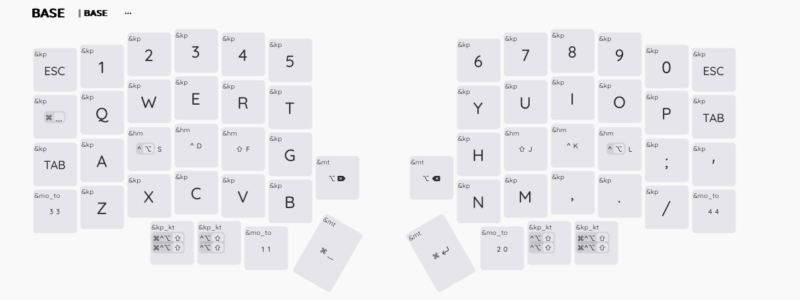
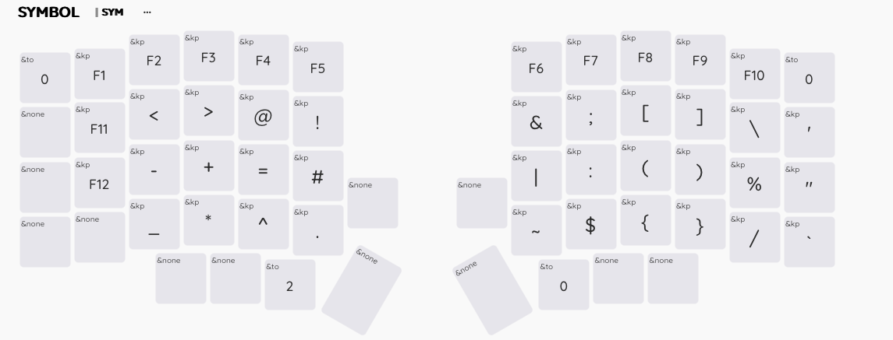
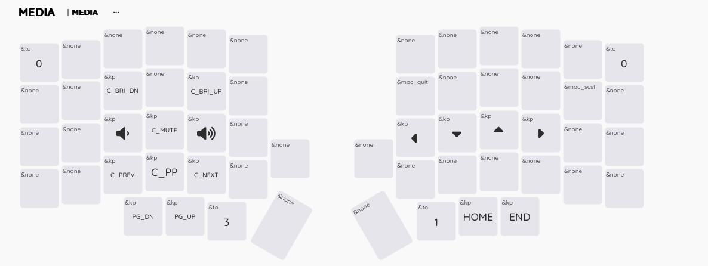
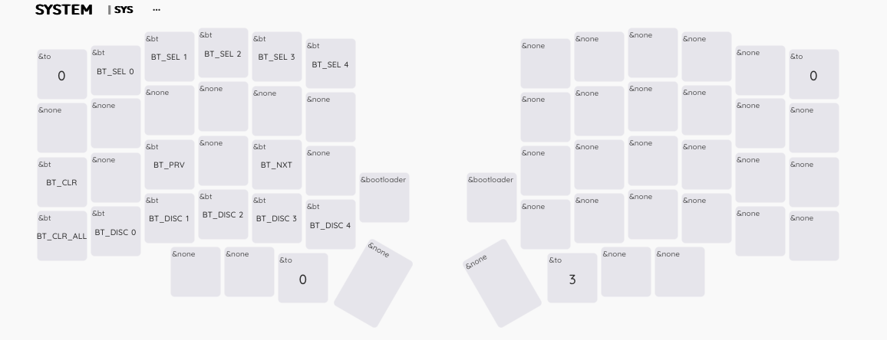

# zmk-config-lily
Lily58 ZMK Configuration
This is my custom configuration which is more adapted for macOS.
It's base on 5 layers:
1. The Base layer which constitute of standard ABC layout which short cut to some frequently use combos.
2. The Symbol layer contains most use symbol like The function keys, brackets, semicolon, etc
3. The Media layer controls media keys like volume, brightness, next/previous tracks along with arrow keys.
4. The numpad layer is about classicalish numpad on the left side and directional arrow, hexadecimal number, and pound sign on the right.
5. The system layer is about controlling the bootloader and the bluetooth connection.

So far this layout served me well but they are hard to memorize when you don't use them daily.
Hence the screen shot below as a reference for my poor memory.

1. Base layer

2.Symbol

3.Media

4.Numpad

5.System

